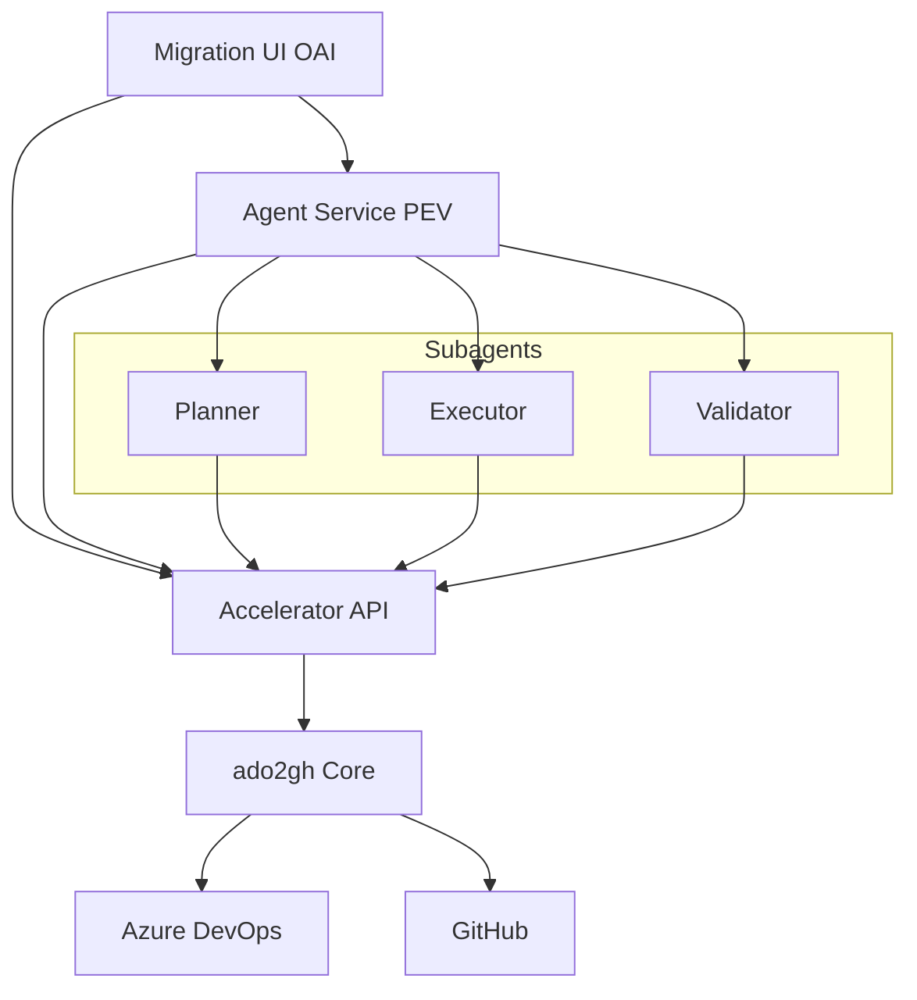
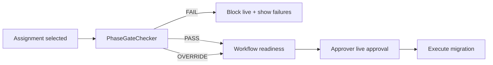

# Implementation Plan: Agentic ADO-to-GitHub Migration Platform

**Branch**: `001-agentic-migration-platform` | **Date**: 2026-06-16 | **Spec**: [spec.md](./spec.md)

**Input**: Feature specification from `/specs/001-agentic-migration-platform/spec.md` plus plan constraints: pipeline branch + topo order; out-of-the-box workflows; ADO pipeline disable; workflow layout; **dependency logging**; **SQLite/Postgres storage**; **agent secret provisioning** on user confirmation.

## Summary

Deliver a dual-mode migration product: (1) **manual accelerator** (CLI + UI + Accelerator API) and (2) **LLM agent** with **Planner → Executor → Validator** subagents, unified under an **OrchestrateAI** frontend. Extend the existing `ado2gh` Python core rather than replacing it.

Key plan additions:

- **Pipeline hard requirement**: Transform every in-scope ADO pipeline to GitHub Actions YAML; commit to dedicated branch (`ado2gh/migrated-workflows` default) via PR—not default branch.
- **Topological execution**: Build repo dependency graph from pipeline resources/templates; sort migration + pipeline push order; surface cycles for humans.
- **Out-of-the-box workflows**: Gate live push on GitHub dependency readiness (secrets, environments, OIDC, feeds); generated YAML references configured targets so teams can run workflows on the migration branch without hand-editing.
- **ADO decommission**: After live workflow branch push, disable/remove ADO pipelines for migrated scope (audited).
- **Maintainable layout**: `consolidated` or `modular` per readiness classification.
- **Dependency logging**: Missing secrets/connections logged to console and run logs (names only).
- **Storage**: SQLite local; PostgreSQL cloud (`create_state_db` + prod Docker Postgres).
- **Agent provisioning**: Prompt to create missing secrets/connections; auto-provision on operator Yes via secure input.
- **Assignments**: POC / pilot / Wave 1–N cohorts linked to execution phases; RBAC Coordinator / Operator / Approver.
- **Phase gates**: Assignment-linked execution phase/wave evaluated via existing `PhaseGateChecker` before cohort live runs; Approver override with audit (FR-034).
- **Scope-targeted rollback**: Extend `RollbackHandler` for accelerator CLI/API/UI and agent executor; **symmetric `pipelines` rollback** re-enables ADO pipelines disabled by FR-048 (FR-026a); Approver required for live rollback (FR-026).
- **Audit**: 7-year immutable full transcript retention with secret redaction.

## Technical Context

**Language/Version**: Python >= 3.9 (`ado2gh`); TypeScript / Next.js (`apps/migration-ui`); FastAPI services (`services/accelerator_api`, `services/agent`)

**Primary Dependencies**: click, requests, PyYAML, rich, pydantic, fastapi, uvicorn, httpx; optional psycopg2, redis, boto3; pytest/pytest-cov (dev)

**Storage**: SQLite WAL local (`ADO2GH_STORAGE_BACKEND=sqlite`); PostgreSQL cloud (`postgres` + `ADO2GH_DATABASE_URL`); prod compose includes Postgres service; optional DynamoDB for serverless path

**Testing**: pytest; golden tests for `PipelineTransformer` and dependency graph; API contract tests; Playwright/design checks for OAI UI; **85% line coverage** on `ado2gh` (CI gate)

**Target Platform**: Linux containers (Docker Compose prod); Windows dev; enterprise on-prem or cloud

**Project Type**: CLI + REST APIs + agent service + web UI

**Performance Goals**: POC repo end-to-end < 30 min manual; agent plan < 2 min (excl. large discovery); parallel cohort execution; pipeline transform parallel per repo (`pipeline_parallel`)

**Constraints**: HITL for all live mutations; Approver for live runs; one live run per repo; secrets never in logs/transcripts; ADO authoritative source; hyperscaler-agnostic LLM

**Scale/Scope**: 5000+ repos; arbitrary Wave N; full Boards parity with gaps report; all assignment types for all subagents

## Constitution Check

*GATE: Must pass before Phase 0 research. Re-check after Phase 1 design.*

Reference: `.specify/memory/constitution.md` (ado2gh v1.0.0)

| Principle | Gate (pass = compliant) |
|-----------|-------------------------|
| I. Clean Code | Extend existing modules; new packages `assignments`, `dependency_graph`, `agents` with clear names |
| II. Documentation | All new public functions/classes with docstrings; versioned subagent skill markdown |
| III. Deprecation | Extend `push_workflows` / PipelinesScopeHandler; no silent pipeline path changes |
| IV. Architecture & Naming | Domain folders: `pipelines/`, `phase/`, `agents/`, `assignments/` |
| V. Enterprise Safeguards | Dry-run, phase gates + Approver on live/rollback, workflow branch+PR, audit, topo order prevents unsafe partial migration |
| VI. Testing (85%+) | pytest-cov in CI; tests for graph sort, branch push, PEV contracts |

**Result (pre-design)**: [x] PASS — all gates satisfied

**Result (post-design)**: [x] PASS — design artifacts define contracts, data model, and test strategy

## Project Structure

### Documentation (this feature)

```text
specs/001-agentic-migration-platform/
├── plan.md              # This file
├── research.md          # Phase 0
├── data-model.md        # Phase 1
├── quickstart.md        # Phase 1
├── contracts/           # Phase 1
│   ├── assignments-api.md
│   ├── agent-pev-api.md
│   ├── pipeline-workflow-branch.md
│   ├── dependency-logging-provisioning.md
│   └── rollback-gates-api.md
└── tasks.md             # Phase 2 (/speckit-tasks)
```

### Source Code (repository root)

```text
ado2gh/
├── cli/                    # Click commands
├── core/                   # migration_engine, wave_runner, rollback.py, scopes/
│   └── scopes/
│       ├── git_scope.py
│       └── pipelines_scope.py
├── phase/
│   ├── gate_checker.py     # EXTEND: assignment-linked phase gates
│   └── batch_executor.py
├── pipelines/
│   ├── extractor.py
│   ├── inventory.py
│   ├── transform/          # PipelineTransformer, job_graph, task_registry
│   └── dependency_graph.py # NEW: topo sort, cycle detection
├── assignments/            # NEW: cohort CRUD, membership, phase link
├── agents/                 # NEW: planner, executor, validator + skills/
├── api/                    # SDK contracts, settings_store, pipeline_runner
├── state/                  # db.py, postgres_db.py, factory.py
├── reporting/              # validator, pipeline_readiness
└── tools/
    └── push_workflows.py   # workflow branch + PR

services/
├── accelerator_api/main.py # REST facade
└── agent/main.py             # PEV loop → extend subagents + sessions

apps/migration-ui/            # Next.js + OrchestrateAI CSS
├── src/app/agent/
├── src/app/migrate/
└── src/components/

tests/
├── test_pipeline_*.py
├── test_dependency_graph.py  # NEW
├── test_assignments.py       # NEW
├── test_agent_pev.py         # NEW
├── test_gate_assignment.py   # NEW
└── test_rollback.py            # NEW
```

**Structure Decision**: Monorepo with Python package as execution core, thin FastAPI services for UI/agent integration, Next.js UI. New logic lives in `ado2gh` for testability and CLI parity; agent service orchestrates via HTTP tools only.

## Architecture Overview



### Migration execution order (per cohort)

1. Discover + inventory pipelines
2. Build `RepoDependencyEdge` graph → topological sort
3. **Phase gate check** on assignment-linked execution phase/wave (`PhaseGateChecker`); block live unless PASS/OVERRIDE (Approver)
4. **Workflow dependency readiness** check (secrets, envs, OIDC, feeds)
5. For each repo in sorted order:
   - Git mirror (if not complete)
   - Other scopes per plan (work items, boards, access)
   - **Pipeline transform** (consolidated or modular layout) → local `output/workflows/...`
   - **Push workflows** → branch `ado2gh/migrated-workflows` + PR
   - **Disable ADO pipelines** for migrated scope (live only, post-push)
6. Validator per scope + Boards gaps report + workflow smoke when readiness green
7. Remediation loop or human escalation
8. **Rollback** (on operator request): scope-targeted undo via `RollbackHandler`; when `pipelines` scope is included, **re-enable ADO pipelines** symmetrically to FR-048 disable (FR-026a); Approver required for live rollback; assignment-scoped audit

## Phase 0 & Phase 1 Outputs

| Artifact | Status |
|----------|--------|
| [research.md](./research.md) | Complete |
| [data-model.md](./data-model.md) | Complete |
| [contracts/](./contracts/) | Complete |
| [quickstart.md](./quickstart.md) | Complete |
| [contracts/rollback-gates-api.md](./contracts/rollback-gates-api.md) | Complete |

## Implementation Phases (for `/speckit-tasks`)

### Phase A — Foundation

- Dependency graph module + persistence
- Assignment entities + API + UI list/create
- RBAC on profile routes
- Audit event writer with redaction
- **Storage**: verify SQLite/Postgres parity for new tables; prod compose Postgres documented
- **Dependency logging** in readiness checks (console + structured run logs)
- **Assignment → phase gate wiring**: resolve `ExecutionPhaseWave` from assignment; expose gate status API (see [Rollback & phase gates](#rollback--phase-gates))

### Phase B — Pipeline branch orchestration

- Wire pipeline scope for all repos in cohort
- Integrate topo order into `BatchExecutor` / wave runner
- **Workflow dependency readiness** API + UI checklist
- **Layout policy** in `PipelineTransformer` (consolidated vs modular)
- Approver gate before `push_workflows` live
- **ADO pipeline disable** step after successful branch push
- Validator: branch, files, layout, dependency refs, ADO disabled, optional smoke run

### Phase C — Agent subagents

- Skill markdown for planner/executor/validator (all assignment types)
- LLM provider abstraction
- Session API + immutable transcript store
- Remediation loop with retry limits
- **Provision flow**: chat prompt → secure value → executor tools → re-readiness

### Phase D — UI & parity

- Assignment management screens
- Workflow branch/PR status per repo
- Agent chat role attribution + approval UX
- Boards gaps report viewer

### Phase E — Quality gate

- pytest-cov 85% CI
- Contract tests for API contracts (including `rollback-gates-api.md`)
- Quickstart scenarios automated where feasible

### Rollback & phase gates

Cross-cutting work spanning Phase A, B, C, and D. Addresses spec **FR-026**, **FR-034**, **FR-019**, **FR-021b**, and constitution Principle V (scope-targeted rollback, gate enforcement, audit).

#### Phase gates (assignment-linked execution)

**Problem**: Selecting an assignment cohort must not bypass risk gates. Each `MigrationAssignment` links to exactly one `ExecutionPhaseWave`; live execution on that cohort requires the mapped phase to pass gates (or documented Approver override).

**Extend existing code** (do not replace):

| Component | Path | Responsibility |
|-----------|------|----------------|
| `PhaseGateChecker` | `ado2gh/phase/gate_checker.py` | Success thresholds, `override()`, `can_advance()` |
| Phase CLI | `ado2gh/cli/phase.py` | `gate-check`, override with reason |
| Accelerator API | `services/accelerator_api/main.py` | Pre-live gate on assignment-scoped migrate |
| Batch executor | `ado2gh/phase/batch_executor.py` | Block live batch when `can_advance` false |
| Agent validator | `ado2gh/agents/validator.py` | `ado2gh_gate_check` tool before live approval |

**New behavior**:

1. **Resolve phase from assignment** — `assignments/store.py` returns linked `PhaseType` / wave id for `assignment_id`.
2. **Gate evaluation scope** — `PhaseGateChecker.check(phase)` runs against repos in the assignment cohort (not only global phase risk scores when assignment-scoped).
3. **Pre-live enforcement** — Before any live `enqueue_job` / `phase run` / agent live approval:
   - If gate status is `FAIL` → return `gate_blocked` with failure list; no mutations.
   - If `PASS` or `OVERRIDE` (with Approver + reason in audit) → proceed to workflow readiness and Approver live gate.
4. **Policy rules (FR-019)** — Profile `policy_rules` augment gates: e.g. block live on `production` phase without second Approver; require extra approval for bulk wave size. Implement in `ado2gh/phase/policy_rules.py` evaluated after base gate check.
5. **API contract** — [rollback-gates-api.md](./contracts/rollback-gates-api.md): `GET /v1/assignments/{id}/gate-status`, `POST /v1/assignments/{id}/gate-override` (Approver).
6. **UI** — Gate status badge on assignment detail and migrate flow; disable live until green or override recorded.



#### Scope-targeted rollback

**Problem**: Operators must undo migration scopes (not only full repo delete) through accelerator and agent with the same Approver and audit rules as live migration (FR-026, FR-018).

**Extend existing code**:

| Component | Path | Responsibility |
|-----------|------|----------------|
| `RollbackHandler` | `ado2gh/core/rollback.py` | Wave, repo, scope-targeted rollback (`branch_policies`, `pipelines`, full repo) |
| ADO pipeline restore | `ado2gh/core/ado_cleanup.py` | Re-enable ADO pipelines when `pipelines` rollback scope (paired with FR-048 disable) |
| CLI | `ado2gh/cli/run_cmd.py` | `ado2gh rollback --wave N --scopes ...` |
| Core rollback | `ado2gh/core/rollback.py` | `rollback_wave`, `rollback_repos` |

**New behavior**:

1. **Assignment-scoped rollback** — Operator selects assignment + repos (subset of cohort); rollback only in-scope repos and scopes authorized by plan/policy.
2. **Dry-run parity** — `dry_run=true` previews rollback actions without mutations (FR-014 alignment).
3. **Approver gate** — Live rollback requires Approver approval ticket (same pattern as live migrate); Operators may request only (FR-021b).
4. **Accelerator API** — `POST /v1/rollback` with `assignment_id`, `repos[]`, `scopes[]`, `dry_run` per contract.
5. **Agent executor** — Whitelist tool `ado2gh_rollback` (scopes + repos from plan or remediation); never ad-hoc shell rollback.
6. **Audit** — `AuditEvent` type `rollback_executed` / `rollback_requested` with assignment cohort, scopes, approver id, dry_run flag; include `ado_pipelines_reenabled` when applicable.
7. **UI** — Rollback panel on runs/assignment views; scope picker matching CLI `--scopes`.
8. **Symmetric pipelines rollback (FR-026a)** — When live rollback includes `pipelines` scope for repos where ADO pipelines were disabled after migration (FR-048):
   - Roll back GitHub workflow artifacts on the migration branch (existing `_rollback_pipelines` path).
   - **Re-enable** the matching ADO pipeline definitions via `ado_cleanup` enable APIs (mirror disable audit trail).
   - Validator confirms ADO enabled state + GitHub rollback outcome; failures block “success” disposition.
   - Dry-run previews both GitHub and ADO re-enable actions without mutations.

**Rollback vs cleanup**: `ado_cleanup` is the forward path (disable ADO after migrate). **Rollback with `pipelines` scope** is the symmetric undo (re-enable ADO + GitHub workflow rollback). Other scopes (e.g., `branch_policies`, `repo`) do not imply ADO re-enable unless explicitly included in rollback scope and policy.

#### Task mapping (for `/speckit-tasks` refresh)

| Work item | Suggested location | Depends on |
|-----------|-------------------|------------|
| Assignment-scoped gate check | `gate_checker.py`, `assignments/store.py` | Phase A assignments |
| Gate API + override | `services/accelerator_api/main.py` | RBAC |
| Policy rules | `ado2gh/phase/policy_rules.py` | Profile settings |
| Gate UI | `apps/migration-ui` migrate/assignments | Gate API |
| Rollback API | `services/accelerator_api/main.py` | RBAC, assignments |
| ADO re-enable on pipelines rollback | `ado2gh/core/ado_cleanup.py`, `rollback.py` | FR-026a, FR-048 |
| Rollback agent tool | `services/agent/mcp_server.py` | Executor whitelist |
| Tests | `tests/test_gate_assignment.py`, `tests/test_rollback.py` | Foundation |

#### Quickstart validation

See [quickstart.md](./quickstart.md) §11 (assignment gate) and §12 (rollback dry-run).

## Complexity Tracking

> No constitution violations requiring justification. Full Boards parity and 7-year audit are spec-mandated scope, not optional complexity.

| Item | Notes |
|------|-------|
| Immutable 7-year audit | User/regulatory requirement; insert-only store |
| Topological graph | Required for dependency-safe migration |
| Separate workflow branch | Required; uses existing `push_workflows` pattern |
